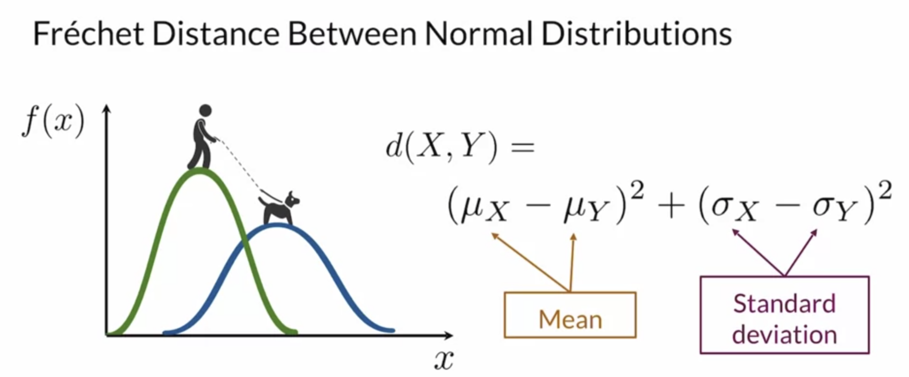

# Two properties need to consider 
## Fidelity
Quality of images
- How realistic your images are looking from your GAN?
## Diversity
Variety of images
- The generated images to cover the whole diversity, the variety of the real distribution meaning if a GAN is only generating the same single image, but it's very realistic, that's not a well performing model.

# Comparing images 
## Pixel distances

## Feature Distance

## Feature Extraction

## Frechet Inception Distance (FID)

